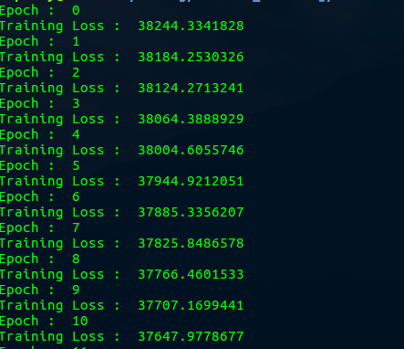

# Multiple Linear Regression

This work is intended purely for understanding purpose only. All the codes are written in Python with the help of NumPy library. Dataset is taken from UCI Machine Learning Repository.

The dataset can be found here : https://archive.ics.uci.edu/ml/datasets/Combined+Cycle+Power+Plant

A pdf file is also included to aid with the mathematics behind the algorithm.

As can be seen above, the model has learnt to predict the y_hat value as close as possible to the y value.

Have fun learning!
